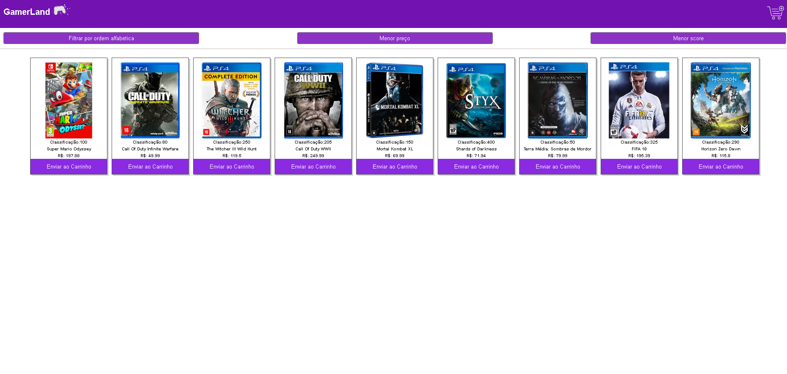
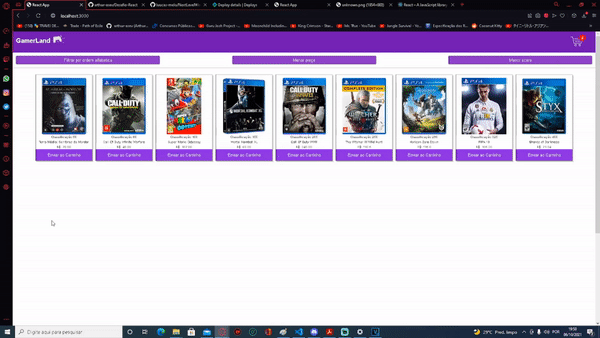

<h2 align="center">  
  <a href="#%EF%B8%8F-sobre">Sobre</a> |
  <a href="#-tecnologias">Tecnologias</a> | 
  <a href="#-download">Download</a> | 
</h2>
<h1 align="center">
  
</h1>

<h1 align= "center">
   
</h1>

## ⁉️ Sobre

GamerLand é uma loja de venda de jogo criada a partir de um desafio proposto pela empresa Supera

## 🚀 Deploy

O deploy da aplicação foi feito no link abaixo:
https://gamerland.netlify.app

## 🚀 Tecnologias

- JavaScript
- HTML
- CSS
- [React](https://reactjs.org)

# 📥 Download

```bash
$ git clone https://github.com/arthur-asev/Desafio-React.git

$ cd Desafio-React

$ npm install

$ npm start

$ access https://localhost:3000
```
